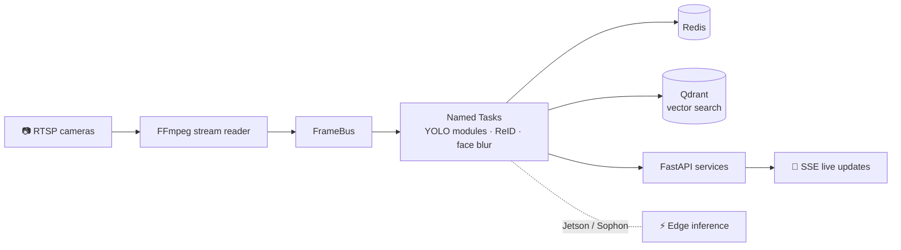

<!-- Profile README: github.com/AhmedHamadaIT/AhmedHamadaIT -->

 

---

## 👋 About Me

AI Engineer at **EyeGo** building production AI systems: real-time, multi-camera Computer Vision on edge hardware (NVIDIA Jetson, Sophon), plus LLM-powered applications and Arabic Document AI design. I work across the full path from **business requirements → PRD → system architecture → deployed service**.

| | |
|---|---|
| 🎯 **Focus** | Production AI · Computer Vision · Edge AI · LLM/VLM · RAG · Agentic AI |
| 🏗️ **Strength** | System architecture, real-time pipelines, AI deployment |
| 🎓 **Education** | B.Sc. Computer Science & Artificial Intelligence, Fayoum University (2020–2024) |
| 📍 **Based in** | Cairo, Egypt |

---

## 🧱 What I Build

Simplified view of the multi-process vision platform I architect at EyeGo.

---

## 💼 Experience

### 🔹 AI Engineer — EyeGo *(June 2025 – Present)*

- **Architecture:** architected a multi-process Vision Pipeline platform (FastAPI, Redis, custom FrameBus + Named Tasks) running concurrent per-camera AI tasks across deployments of 20–100 cameras, with roughly 2–5 s latency.
- **Product & design:** contributed to the product requirements and system design for the LLM capabilities of EyeGo and EyeGo Studio.
- **Computer Vision & Edge AI:** shipped 8 YOLO-based compliance modules; deployed real-time inference on NVIDIA Jetson and Sophon; built cross-camera person ReID with Qdrant.
- **Backend & privacy:** FastAPI + RTSP + SSE services, a custom FFmpeg stream reader (HEVC → H.264), and a Redis-controlled face-blurring pipeline for saved evidence imagery.

### 🔹 Machine Learning Engineer — Codsoft *(July 2023 – September 2023)*

- Developed and deployed ML models with a focus on feature engineering and performance optimization, collaborating with cross-functional teams.

---

## 🚀 Featured Projects

<table>
<tr>
<td width="50%" valign="top">

### 📄 Basira — Arabic Document AI Platform
*Design & PRD · simulated 1.2M-page archive*

On-prem, air-gap-ready platform: OCR, hybrid semantic search, knowledge graph, cited Q&A, and a human-approved triage agent.

`FastAPI` `Qdrant` `Neo4j` `vLLM` `LangGraph`

</td>
<td width="50%" valign="top">

### 📹 Computer Vision Analytics Suite
*Real-time dashboards*

People counting, heatmaps, dwell time, and crowd density. 92% tracking accuracy with DeepSORT; 4 concurrent streams at 30 FPS.

`YOLOv8` `OpenCV` `DeepSORT` `FastAPI` `Streamlit`

</td>
</tr>
<tr>
<td width="50%" valign="top">

### 🎙️ Arabic Multimodal Voice AI
*TTS fine-tuning + voice ordering*

Fine-tuned Arabic TTS (Qwen3-TTS, F5-TTS, Chatterbox) on Gulf/Najdi dialects; built a Whisper → LLM → TTS drive-through ordering pipeline.

`Qwen3-TTS` `F5-TTS` `Whisper`

</td>
<td width="50%" valign="top">

### 📰 Financial News Sentiment (DistilBERT)
*NLP fine-tuning*

Fine-tuned DistilBERT on financial news: 84% accuracy, 0.84 F1.

`PyTorch` `Hugging Face` `NLP`

</td>
</tr>
</table>

### 🏆 Kaggle

| Notebook | What it does |
|---|---|
| [Child Mind Institute: Detect BFRB with Sensor](https://www.kaggle.com/code/ahmedxhamada/child-mind-institute-detect-bfrb-with-sensor) | Sensor-based ML to detect body-focused repetitive behaviors |
| [Airline Delay Cause Analysis](https://www.kaggle.com/code/ahmedxhamada/airline-delay-cause) | Analysis and predictive modeling of delay causes |
| [Customer Segmentation](https://www.kaggle.com/code/ahmedxhamada/customer-segmentation) | Clustering for targeted marketing |

---

## 🛠️ Tech Stack

| Area | Skills |
|---|---|
| 👁️ **Computer Vision** | YOLOv8, Object Detection, Multi-Object Tracking (ByteTrack, DeepSORT), Person Re-ID, OCR, SAM, Grounding DINO, Pose Estimation |
| 🤖 **LLM / VLM / Agents** | RAG, Agentic & Multi-Agent Systems, LangChain, LangGraph, MCP, Tool Calling, GPT-4/4o, Gemini, Qwen-VL |
| 🔎 **Retrieval** | Qdrant, Pinecone, ChromaDB, Semantic Search, Re-ranking, RAGAS, DeepEval |
| 🔊 **Speech & Multimodal** | Whisper, Qwen3-TTS, F5-TTS, QLoRA, TTS/ASR Fine-Tuning |
| ⚡ **Edge & Optimization** | NVIDIA Jetson, Sophon, TensorRT, ONNX |
| 🧩 **Backend & Real-time** | FastAPI, Flask, REST, WebSockets, SSE, RTSP, LiveKit, WebRTC |
| 🚢 **MLOps & Deployment** | Docker, CI/CD, MLflow, Model Monitoring |
| 📐 **Product & Architecture** | PRDs, Requirements Analysis, System Architecture, AI Solution Design |
| 📊 **Data** | Pandas, NumPy, Scikit-learn, SQL, Matplotlib, Seaborn, Power BI |

---

## 📊 GitHub Stats

---

## 🎓 Education & Certifications

- 🎓 **B.Sc. Computer Science & Artificial Intelligence**, Fayoum University (2020–2024). Graduation project (team leader): deep-learning brain tumor classification.
- 📐 Software Design and Architecture Specialization — Coursera
- 🧠 Machine Learning Specialization · Neural Networks and Deep Learning — Andrew Ng, Coursera
- 🤗 Large Language Models with Hugging Face
- 📋 Google Project Management: Professional Certificate

---

## 📫 Get in Touch

Open to collaboration and new opportunities.

