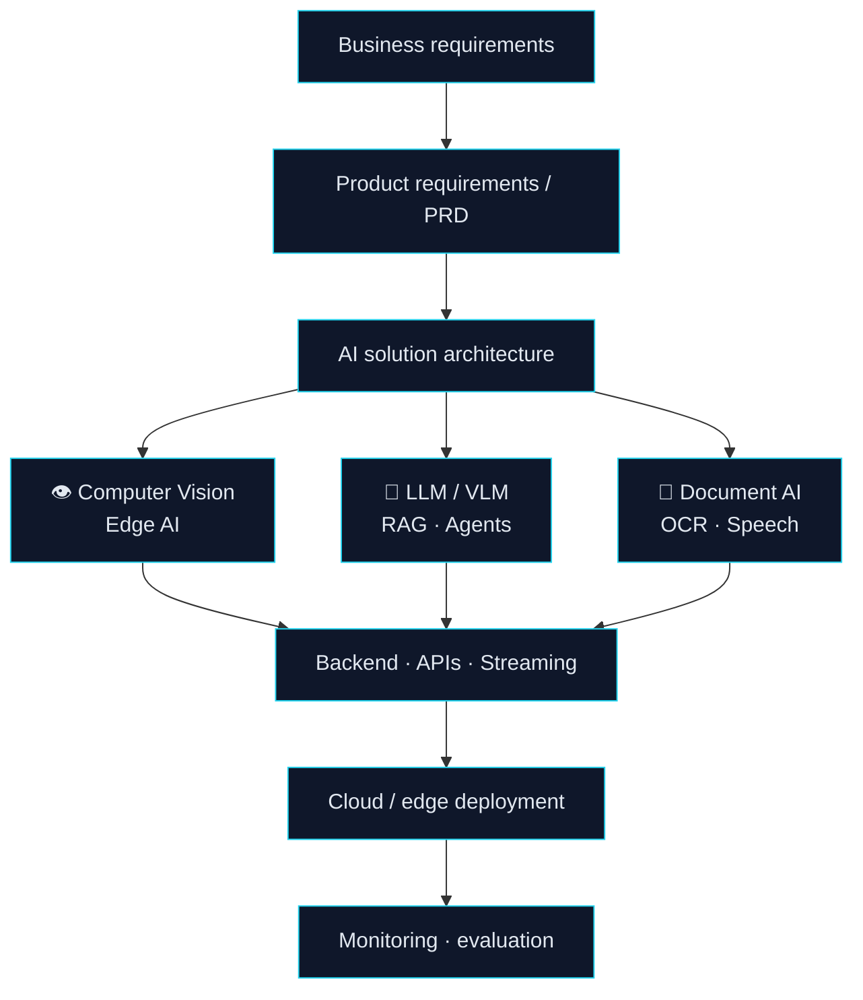
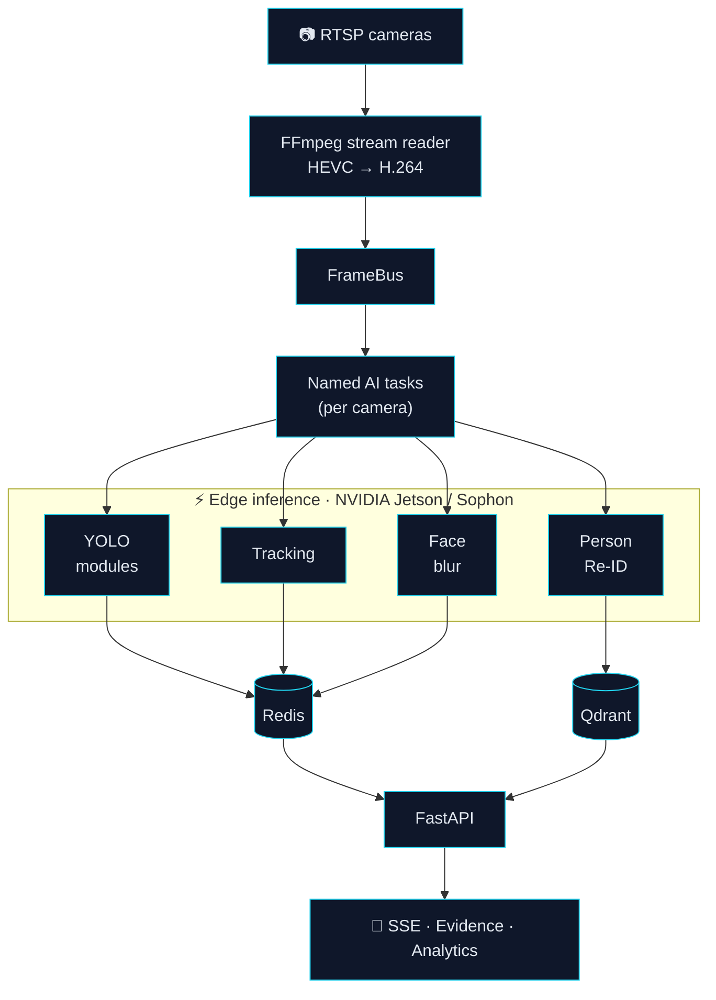
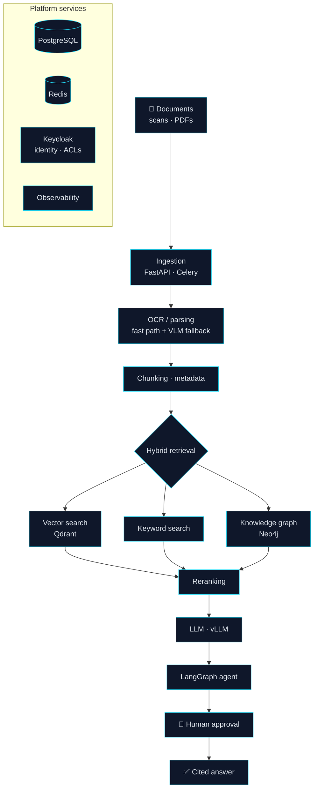

<!-- Profile README: github.com/AhmedHamadaIT/AhmedHamadaIT -->

<div align="center">


<a href="https://github.com/AhmedHamadaIT"></a>

<br/>


</div>

---

## 🎯 AI Engineer Profile

<table>
<tr>
<td width="50%" valign="top">
<b>🎯 Focus</b><br/>Production AI · AI solution design<br/><br/>
<b>🏗️ Architecture</b><br/>Multi-process real-time pipelines, PRD-to-system design<br/><br/>
<b>👁️ Computer Vision</b><br/>Multi-camera detection, tracking, cross-camera Re-ID<br/><br/>
<b>🤖 Generative AI</b><br/>LLM / VLM apps, RAG, agentic workflows
</td>
<td width="50%" valign="top">
<b>⚡ Edge AI</b><br/>NVIDIA Jetson, Sophon<br/><br/>
<b>📄 Document AI</b><br/>Arabic OCR, hybrid retrieval, knowledge graphs<br/><br/>
<b>🧠 Product / PRD</b><br/>Requirements to architecture to implementation<br/><br/>
<b>📍 Location</b> Cairo, Egypt<br/>
<b>🎓 Education</b> B.Sc. CS &amp; AI, Fayoum University
</td>
</tr>
</table>

> **AI Engineer at EyeGo, working across the full lifecycle:** I take business requirements, turn them into PRDs and AI solution designs, architect the system, build the AI and backend pipelines, and deploy them to production and edge infrastructure.

---

## 🧱 What I Build



---

## 🏭 Production Experience

### AI Engineer · EyeGo &nbsp;<sub>June 2025 – Present</sub>

<table align="center">
<tr>
<td align="center" width="20%"><h2>20–100</h2><sub>cameras<br/>(approx.)</sub></td>
<td align="center" width="20%"><h2>2–5 s</h2><sub>latency<br/>(approx.)</sub></td>
<td align="center" width="20%"><h2>8</h2><sub>YOLO-based<br/>modules</sub></td>
<td align="center" width="20%"><h2>Edge</h2><sub>real-time inference<br/>Jetson · Sophon</sub></td>
<td align="center" width="20%"><h2>Re-ID</h2><sub>cross-camera<br/>identity</sub></td>
</tr>
</table>

<table>
<tr>
<td width="50%" valign="top">

**🏗️ Architecture**
- Architected a multi-process Vision Pipeline platform (FastAPI, Redis, custom **FrameBus + Named Tasks**) for concurrent per-camera AI task execution across restaurant, café, and drive-through deployments.

**👁️ Computer Vision**
- Shipped 8 YOLO-based compliance modules: eating-violation detection, handwashing verification, cleanliness/obstruction monitoring, closing-procedure checks, and cup counting.
- Built cross-camera person re-identification with Qdrant and batched upserts.
- Built an AI vending-machine recommendation engine using behavior analysis and customer tracking.

**⚡ Edge AI**
- Deployed and optimized real-time inference on NVIDIA Jetson and Sophon under on-device latency and hardware constraints.

</td>
<td width="50%" valign="top">

**🧠 Product & AI Design**
- Contributed to the product requirements and system design for the LLM capabilities of EyeGo and EyeGo Studio, translating business requirements into PRDs and architecture.

**🔌 Backend & Streaming**
- Built FastAPI services integrating AI inference with RTSP multi-camera ingestion and Server-Sent Events for live updates.
- Wrote a custom FFmpeg subprocess stream reader, migrating ingestion from HEVC to H.264.

**🔐 Privacy**
- Implemented a per-camera face-blurring pipeline for saved evidence imagery, with Redis-backed real-time toggles.

</td>
</tr>
</table>

<sub>Earlier: **Machine Learning Engineer, Codsoft** (Jul – Sep 2023). Developed and deployed ML models with a focus on feature engineering and performance optimization.</sub>

### EyeGo vision platform architecture



---

## 🧠 AI Solution Architecture

<table>
<tr>
<td width="46%" valign="top">

```text
┌─────────────────────────────────────────┐
│          AI SOLUTION LIFECYCLE          │
├─────────────────────────────────────────┤
│ 1  Business requirements                │
│    ↓                                    │
│ 2  PRD / use cases                      │
│    ↓                                    │
│ 3  Architecture & model selection       │
│    ↓                                    │
│ 4  Data · retrieval · agents            │
│    ↓                                    │
│ 5  Backend · APIs · streaming           │
│    ↓                                    │
│ 6  Cloud / edge deployment              │
│    ↓                                    │
│ 7  Evaluation · monitoring              │
└─────────────────────────────────────────┘
```

</td>
<td width="54%" valign="top">

I work across the **entire lifecycle** of an AI product rather than a single layer.

- **EyeGo:** requirements and PRDs, platform architecture, CV/AI pipelines, backend streaming, edge deployment.
- **Basira:** requirements analysis, PRD, and full system architecture for an Arabic Document AI platform (design stage).
- **Principle:** pick the right tool per task. Deterministic logic where it is safer, AI where it adds value.

</td>
</tr>
</table>

### Where product, engineering, and AI meet

```text
                  PRODUCT
            (requirements · PRDs)
                     ▲
                     │
   AI ◄──────────────┼──────────────► ENGINEERING
 (models · LLMs)     │          (backend · streaming)
                     ▼
                DEPLOYMENT
            (edge · production)
```

I work at the intersection of AI engineering, product requirements, and system architecture.

---

## 🚀 Featured AI Systems

<table>
<tr>
<td colspan="2" valign="top">

### 📄 Basira · Arabic Document AI & Knowledge Platform
**Flagship** · *Architecture / PRD design based on a simulated scenario (a 1.2M-page government archive). Design stage, not a production deployment.*

**Problem:** staff cannot find or connect decisions buried in a huge Arabic/English archive of scans and PDFs with inconsistent metadata.

**Capabilities:** OCR with fallback · hybrid semantic search · knowledge graph · cited answers · human-approved triage agent · ACLs enforced at retrieval · gold-set evaluation · on-prem / air-gap-ready.

`FastAPI` `Celery · Redis` `PostgreSQL` `Qdrant` `Neo4j` `vLLM` `LangGraph` `Keycloak` `Langfuse · Prometheus`

<!-- TODO: add link to Basira document / repo if made public -->

</td>
</tr>
<tr>
<td width="50%" valign="top">

### 📹 Computer Vision Analytics Suite
*Real-time dashboards*

**Problem:** turn live camera feeds into counts and zone analytics.

People counting (bi-directional), heatmaps, dwell time, crowd density. Reported 92% tracking accuracy with DeepSORT; 4 concurrent streams at 30 FPS.

`YOLOv8` `OpenCV` `DeepSORT` `FastAPI` `Streamlit`

<!-- TODO: add repo link -->

</td>
<td width="50%" valign="top">

### 🎙️ Arabic Multimodal Voice AI
*TTS fine-tuning + voice ordering*

**Problem:** natural Arabic voice interaction for ordering.

Fine-tuned Arabic TTS (Qwen3-TTS, F5-TTS, Chatterbox) on Gulf and Najdi dialects; built a Whisper → LLM → TTS drive-through ordering pipeline.

`Qwen3-TTS` `F5-TTS` `Whisper` `QLoRA`

<!-- TODO: add repo link -->

</td>
</tr>
<tr>
<td width="50%" valign="top">

### 📰 Financial News Sentiment
*NLP fine-tuning*

**Problem:** classify sentiment of financial news.

Fine-tuned DistilBERT with data preprocessing and visualization: 84% accuracy, 0.84 F1.

`PyTorch` `Hugging Face` `NLP`

<!-- TODO: add repo link -->

</td>
<td width="50%" valign="top">

### 🏆 Kaggle
*Selected notebooks*

- [Detect BFRB with Sensor Data](https://www.kaggle.com/code/ahmedxhamada/child-mind-institute-detect-bfrb-with-sensor)
- [Airline Delay Cause Analysis](https://www.kaggle.com/code/ahmedxhamada/airline-delay-cause)
- [Customer Segmentation](https://www.kaggle.com/code/ahmedxhamada/customer-segmentation)

</td>
</tr>
</table>

### Basira architecture <sub>(design)</sub>



---

## 🧩 AI Systems I Work With

<table>
<tr>
<td width="33%" valign="top"><b>👁️ Computer Vision</b><br/>YOLOv8 · DeepSORT / ByteTrack · Person Re-ID · OpenCV</td>
<td width="33%" valign="top"><b>⚡ Edge AI</b><br/>NVIDIA Jetson · Sophon · TensorRT · ONNX</td>
<td width="33%" valign="top"><b>🤖 LLM / VLM</b><br/>GPT-4/4o · Gemini · Qwen-VL · Florence-2</td>
</tr>
<tr>
<td valign="top"><b>🔎 RAG / Retrieval</b><br/>Qdrant · Semantic search · Reranking · RAGAS / DeepEval</td>
<td valign="top"><b>🧠 Agents</b><br/>LangGraph · LangChain · MCP · Tool calling</td>
<td valign="top"><b>📄 Document AI</b><br/>OCR · Hybrid retrieval · Knowledge graph <sub>(Basira design)</sub></td>
</tr>
<tr>
<td valign="top"><b>🎙️ Speech</b><br/>Whisper · Qwen3-TTS · F5-TTS · QLoRA</td>
<td valign="top"><b>🧩 Backend</b><br/>FastAPI · Redis · SSE / WebSockets · FFmpeg / RTSP</td>
<td valign="top"><b>🚢 MLOps</b><br/>Docker · CI/CD · MLflow · Model monitoring</td>
</tr>
</table>

### Technology stack

| Area | Technologies |
|:--|:--|
| **🤖 AI / ML** | `Python` `PyTorch` `TensorFlow` `OpenCV` `YOLOv8` `Hugging Face` `LangChain` `LangGraph` |
| **🧩 Backend & Streaming** | `FastAPI` `Flask` `Redis` `WebSockets / SSE` `FFmpeg` `RTSP` |
| **🔎 Data & Retrieval** | `Qdrant` `PostgreSQL` `MongoDB` `Neo4j` `Pinecone` `ChromaDB` |
| **🚢 Deployment** | `Docker` `Git` `CI/CD` `MLflow` |
| **⚡ Edge** | `NVIDIA Jetson` `Sophon` `TensorRT` `ONNX` |
| **☁️ Cloud** | `Google Cloud` |

### Core strengths

| Capability | Working depth | Level |
|:--|:--|:--|
| **Computer Vision** | 🟦🟦🟦🟦🟦🟦🟦🟦🟦 | Core |
| **Edge AI** | 🟦🟦🟦🟦🟦🟦🟦🟦 | Core |
| **Backend AI Systems** | 🟦🟦🟦🟦🟦🟦🟦🟦 | Strong |
| **AI Solution Architecture** | 🟦🟦🟦🟦🟦🟦🟦 | Strong |
| **LLM / RAG / Agents** | 🟦🟦🟦🟦🟦🟦🟦 | Strong |
| **Product / PRD** | 🟦🟦🟦🟦🟦🟦🟦 | Strong |
| **MLOps** | 🟦🟦🟦🟦🟦🟦 | Growing |

<sub>Self-assessed working depth and current focus, not a certification or benchmark.</sub>

---

## 📊 GitHub

<p align="center">
  
  
</p>

<p align="center"><sub>Stats reflect public repositories. Most production work (EyeGo) lives in private company repositories.</sub></p>

---

## 🎓 Education & Certifications

```text
2020 ━━━━━━━━━━━━━━━━━━━━━━━━━━━━━━━ 2024
B.Sc. Computer Science & Artificial Intelligence · Fayoum University
```

Graduation project (team leader): deep-learning brain tumor classification.

| Certification | Provider |
|---|---|
| Software Design and Architecture Specialization | Coursera |
| Machine Learning Specialization | Andrew Ng, Coursera |
| Neural Networks and Deep Learning | Andrew Ng, Coursera |
| Large Language Models with Hugging Face | Hugging Face |
| Google Project Management: Professional Certificate | Google |

---

## 🚀 What I'm Interested In

- Senior AI Engineer and AI Solutions Engineer roles
- AI system architecture and AI product design
- Computer Vision and Edge AI
- LLM / RAG / agentic systems and Document AI

---

## 📫 Let's Connect

<div align="center">

Interested in AI systems, Computer Vision, Edge AI, or LLM architecture? Let's connect.

[](https://www.linkedin.com/in/ahmed-hamadaai/)
[](https://github.com/AhmedHamadaIT)
[](https://www.kaggle.com/ahmedxhamada)
[](mailto:ahmed1hamada1shabaan@gmail.com)


</div>
